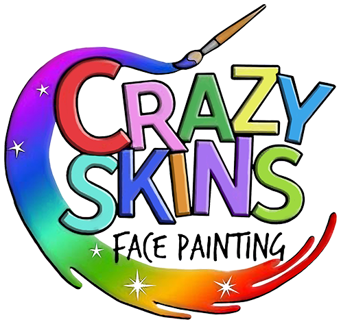

<div id="top"></div>

[![Issues][issues-shield]][issues-url]
[![LinkedIn][linkedin-shield]][linkedin-url]

<!-- PROJECT LOGO -->
<br />
<div align="center">
  <a href="https://github.com/joewhocodes/crazy-skins-new">
    
  </a>

<h3 align="center">Crazy Skins</h3>

  <p align="center">
    Facepainting company website
  </p>
    <br />
    <a href="https://github.com/joewhocodes/crazy-skins-new"><strong>Explore the docs »</strong></a>
    <br />
    <br />
    <a href="https://crazyskinsnorwich.netlify.app">View Demo</a>
    ·
    <a href="https://github.com/joewhocodes/crazy-skins-new/issues">Report Bug</a>
    ·
    <a href="https://github.com/joewhocodes/crazy-skins-new/issues">Request Feature</a>
  </p>
</div>


<!-- TABLE OF CONTENTS -->
<details>
  <summary>Table of Contents</summary>
  <ol>
    <li>
      <a href="#about-the-project">About The Project</a>
      <ul>
        <li><a href="#built-with">Built With</a></li>
      </ul>
    </li>
    <li>
      <a href="#getting-started">Getting Started</a>
      <ul>
        <li><a href="#prerequisites">Prerequisites</a></li>
        <li><a href="#installation">Installation</a></li>
      </ul>
    </li>
    <li><a href="#license">License</a></li>
    <li><a href="#contact">Contact</a></li>
  </ol>
</details>


<!-- ABOUT THE PROJECT -->
## About The Project

[![Product Name Screen Shot][product-screenshot]](https://crazyskinsnorwich.netlify.app)


</p>
    <p align="center">
    This is Crazy Skins, a facepainting company in Norwich, UK
    <br>
    <br>

<p align="right">(<a href="#top">back to top</a>)</p>

### Built With

* [Bootstrap](https://getbootstrap.com)

<p align="right">(<a href="#top">back to top</a>)</p>


<!-- GETTING STARTED -->
## Getting Started

To get a local copy up and running follow these simple example steps.

### Prerequisites

* None

### Installation

1. Clone the repo
   ```sh
   git clone https://github.com/joewhocodes/crazy-skins-new.git
   ```


<p align="right">(<a href="#top">back to top</a>)</p>


<!-- ROADMAP -->
<!-- ## Roadmap

- [ ] Feature 1
- [ ] Feature 2
- [ ] Feature 3
    - [ ] Nested Feature -->

See the [open issues](https://github.com/joewhocodes/crazy-skins-new/issues) for a full list of proposed features (and known issues).

<p align="right">(<a href="#top">back to top</a>)</p>


<!-- LICENSE -->
## License

Copyright (c) 2023 Joe Ulyatt. See `LICENSE.txt` for more information.

<p align="right">(<a href="#top">back to top</a>)</p>


<!-- CONTACT -->
## Contact

Joe Ulyatt - [@joewhocodes](https://twitter.com/joewhocodes) - joewhocodes@gmail.com

Project Link: [https://github.com/joewhocodes/crazy-skins-new](https://github.com/joewhocodes/crazy-skins-new)

<p align="right">(<a href="#top">back to top</a>)</p>


<!-- MARKDOWN LINKS & IMAGES -->
<!-- https://www.markdownguide.org/basic-syntax/#reference-style-links -->
[contributors-shield]: https://img.shields.io/github/contributors/joewhocodes/crazy-skins-new.svg?style=for-the-badge
[contributors-url]: https://github.com/joewhocodes/crazy-skins-new/graphs/contributors
[forks-shield]: https://img.shields.io/github/forks/joewhocodes/crazy-skins-new.svg?style=for-the-badge
[forks-url]: https://github.com/joewhocodes/crazy-skins-new/network/members
[stars-shield]: https://img.shields.io/github/stars/joewhocodes/crazy-skins-new.svg?style=for-the-badge
[stars-url]: https://github.com/joewhocodes/crazy-skins-new/stargazers
[issues-shield]: https://img.shields.io/github/issues/joewhocodes/crazy-skins-new.svg?style=for-the-badge
[issues-url]: https://github.com/joewhocodes/crazy-skins-new/issues
[license-shield]: https://img.shields.io/github/license/joewhocodes/crazy-skins-new.svg?style=for-the-badge
[license-url]: https://github.com/joewhocodes/crazy-skins-new/blob/main/LICENSE.txt
[linkedin-shield]: https://img.shields.io/badge/-LinkedIn-black.svg?style=for-the-badge&logo=linkedin&colorB=555
[linkedin-url]: https://linkedin.com/in/joewhocodes
[product-screenshot]: ./img/screenshot.png
